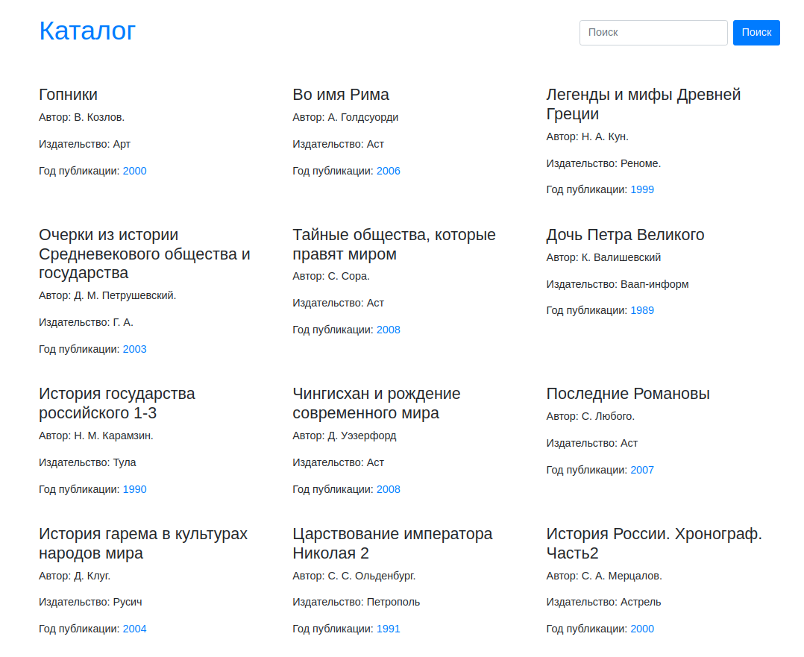

# Book Catalog

This is a minimalist web application designed for browsing and searching books. It was created as a Django templates alternative to the original ["so-books.ru" project](https://github.com/VladIakimenko/so-books.ru), disigned to showcase a vast private book library, and built with Django Rest Framework for the backend + node.js application for the frontend.   
This project on the opposite harnesses the power of Django's built-in capabilities and is accompanied by the features of Bootstrap. This provides a clean and intuitive user interface, optimized for both mobile and desktop use.  

## Core Features

*Book Browsing:* The application allows users to browse through an extensive list of books. Each book entry displays the name of the book, the author, the publisher, and the year of publication.  

*Search Functionality:* Users can quickly locate books using the search function. The search queries the book name, author, publisher, and publication year, providing a comprehensive search experience.  

*Year-wise Book Listing:* The application provides an ability to list books based on their publication year. This feature can be accessed by clicking on the publication year of any book.  

## Architecture

The Django Book Catalog is built around Django's Model-View-Template (MVT) architectural pattern. It uses Django templates for the frontend, offering a server-side rendered user experience.
Bootstrap, a popular CSS framework, is employed for responsive design and aesthetic enhancement. Bootstrap's classes are used within Django templates to make the application mobile-friendly and visually appealing.

